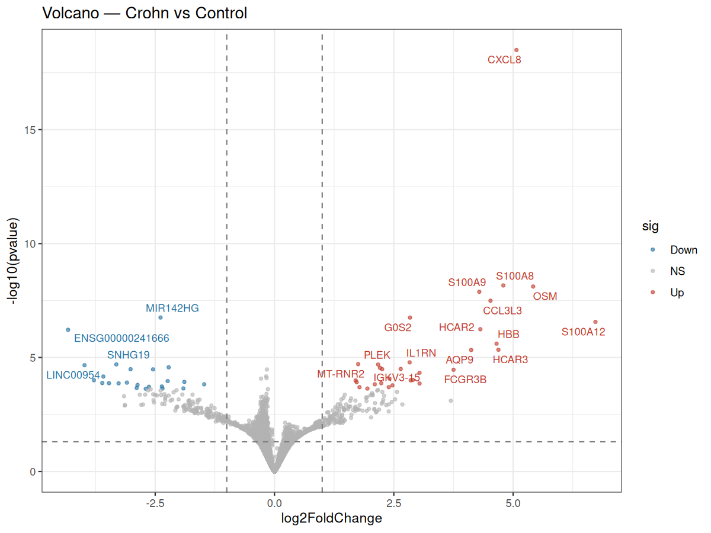
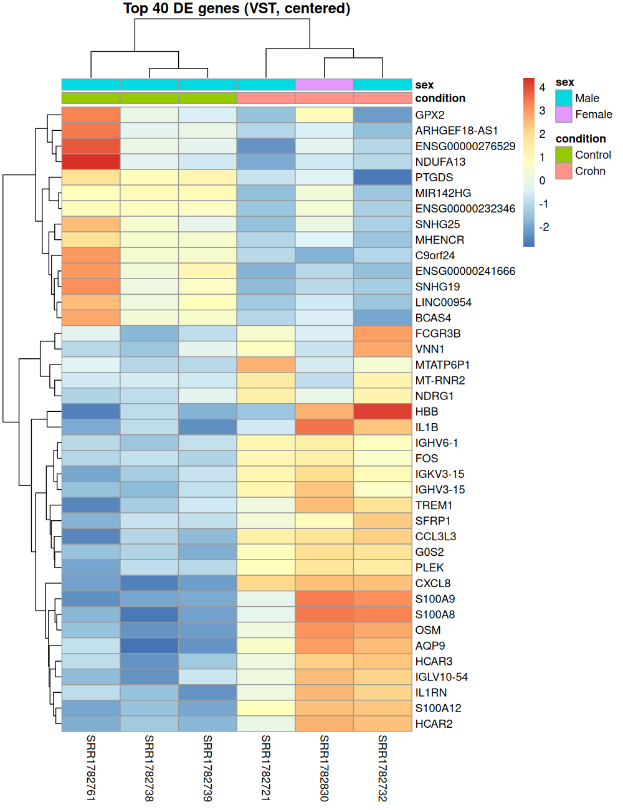
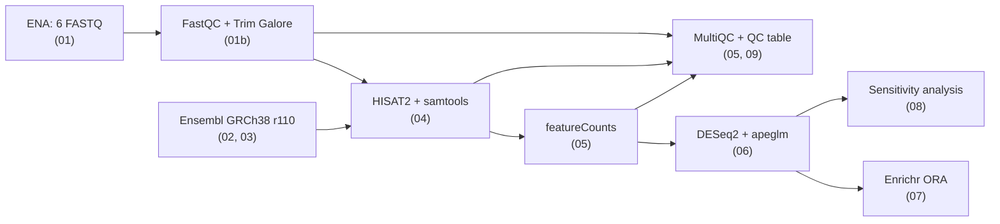
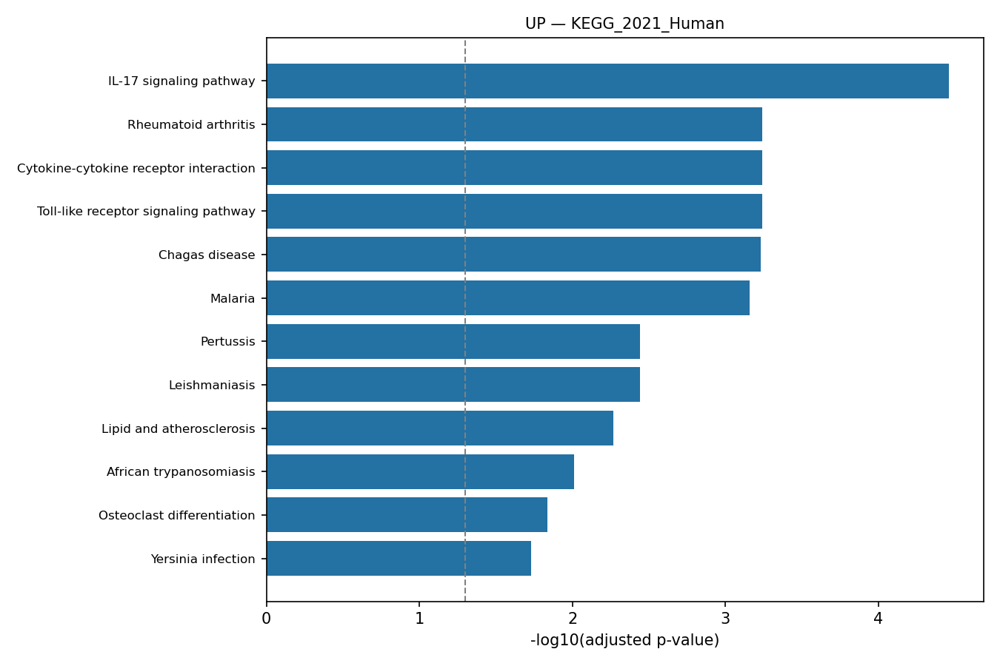
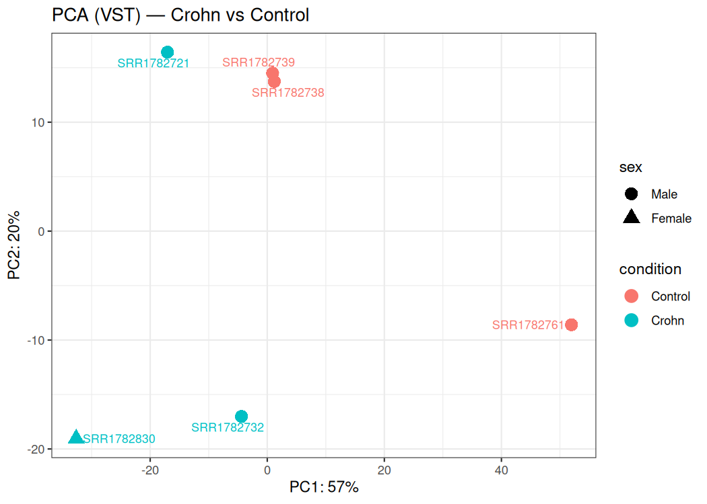
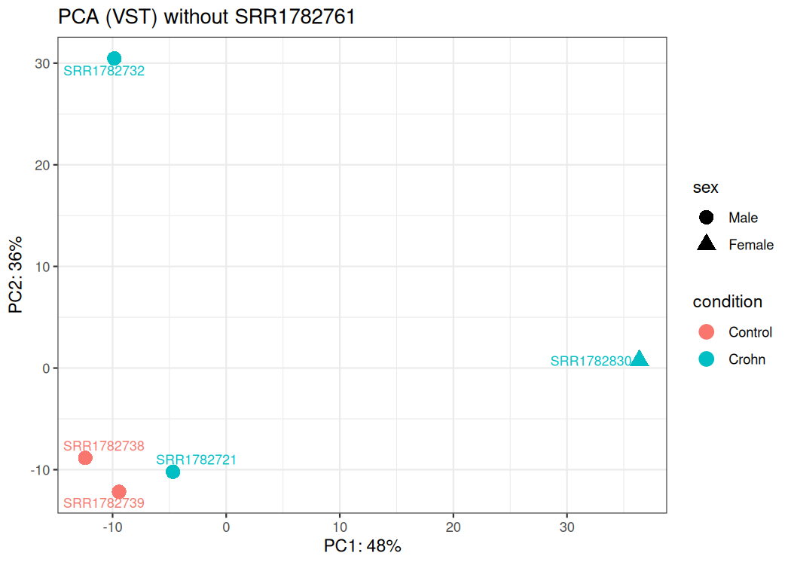

# Bulk RNA-seq of Crohn's disease ileum: from raw reads to pathways

<!-- markdownlint-disable MD033 -- inline HTML is used to place figures side by side -->

[](https://www.r-project.org/)
[](https://bioconductor.org/packages/DESeq2/)
[](https://daehwankimlab.github.io/hisat2/)
[](LICENSE)

**An end-to-end, reproducible analysis of public RNA-seq data (GEO
[GSE57945](https://www.ncbi.nlm.nih.gov/geo/query/acc.cgi?acc=GSE57945)): read QC,
spliced alignment, gene counting, differential expression and pathway enrichment.
It also includes a sensitivity analysis and a comparison with the original publication.**

Treatment-naive paediatric ileal biopsies from the RISK cohort
([Haberman et al., *J Clin Invest* 2014](https://doi.org/10.1172/JCI75436)):
**3 Crohn's disease (CD) vs 3 non-IBD controls**.

---

## Contents

- [Key findings](#key-findings)
- [Pipeline](#pipeline)
- [Quality control](#quality-control)
- [Results](#results)
- [Limitations](#limitations)
- [Reproduce the analysis](#reproduce-the-analysis)
- [Repository structure](#repository-structure)
- [Author](#author)

## Key findings

- **58 differentially expressed genes** (FDR < 5%): 31 up and 27 down in Crohn's disease.
- **A neutrophil-driven inflammatory programme is up-regulated:** CXCL8 (IL-8),
  calprotectin (S100A8/S100A9), S100A12, OSM, IL1B, TREM1 and IL1RN. The top pathways
  are IL-17 signalling (KEGG, adj. p = 3.4 × 10⁻⁵), neutrophil chemotaxis and TNF-α
  signalling via NF-κB.
- **The up-regulated signal is robust.** 30 of the 31 up-regulated genes stay significant
  after removing the outlier control sample. The down-regulated set is weaker: 6 of 27
  genes replicate, because several of them are high in that one control.
- **The published signature agrees in direction.** The study reported DUOX2 up and APOA1
  down. Here DUOX2 is up (log2FC +1.6) together with its partner DUOXA2 (+2.8,
  p = 0.002), and APOA1 trends down (−1.4).
- **Antimicrobial peptides DEFA5 and REG3A are robustly down-regulated.** This agrees with
  reports of reduced Paneth-cell α-defensins in ileal Crohn's disease
  ([Wehkamp et al., *PNAS* 2005](https://doi.org/10.1073/pnas.0505256102)).

<p align="center">
  
  
</p>

## Pipeline



| Step | Tool (version) | Script | Key settings |
| --- | --- | --- | --- |
| Download | ENA API, wget | `01_download_data.sh` | MD5 verified against ENA; idempotent |
| Read QC and trimming | FastQC 0.12.1, Trim Galore 2.2.0, MultiQC 1.35 | `01b_qc_trim.sh` | Phred ≥ 20, stringency 1, min length 20 bp |
| Reference | Ensembl GRCh38, release 110 | `02_download_reference.sh` | primary assembly (no alt loci); checksums verified |
| Index | HISAT2 2.2.2 | `03_build_index.sh` | plain index (~6 GB RAM) plus 402,402 known splice sites |
| Alignment | HISAT2 2.2.2, samtools 1.23.1 | `04_align.sh` | single-end `-U`, `--known-splicesite-infile` |
| Counting | featureCounts (Subread 2.1.1) | `05_featurecounts.sh` | `-t exon -g gene_id`; strandedness tested empirically (`-s 0`) |
| Differential expression | DESeq2 1.42.1 (R 4.3.3), apeglm 1.24.0 | `06_deseq2.R` | `~ sex + condition`; ≥ 10 reads in ≥ 3 samples |
| Enrichment | Enrichr API | `07_enrichr.py` | GO, KEGG, Reactome, Hallmark; background = 14,378 tested genes |
| Robustness | DESeq2 | `08_sensitivity_analysis.R` | leave-one-out refit; published-marker check |
| QC table | Python, pandas | `09_qc_summary.py` | per-sample summary of every step |

### Design decisions

- **Memory-aware index.** A HISAT2 graph index with splice sites and exons needs ~160 GB
  RAM. A plain index plus `--known-splicesite-infile` gives the same spliced alignment on
  a 64 GB workstation.
- **Strandedness is measured, not assumed.** One sample is counted with `-s 0/1/2`.
  Unstranded counting assigns 2.88 M reads, against 1.53 M for either stranded setting.
- **Sex is a covariate.** The only female sample is in the CD group, so sex-linked genes
  would otherwise leak into the disease effect. The recorded sex was checked against
  XIST, RPS4Y1, DDX3Y and UTY expression.
- **Shrinkage and background.** Fold changes are shrunk with apeglm. Enrichment uses the
  genes actually tested as background, not the whole genome.

## Quality control

Built by `09_qc_summary.py`. The MultiQC reports are in
[`results/fastqc_raw`](results/fastqc_raw/multiqc_raw.html),
[`results/fastqc_trimmed`](results/fastqc_trimmed/multiqc_trimmed.html) and
[`results/multiqc`](results/multiqc/alignment_multiqc.html).

| Sample | Group | Sex | Raw reads (M) | Kept after trimming | Aligned | Multi-mapped | Assigned reads (M) | Size factor |
| --- | --- | --- | --- | --- | --- | --- | --- | --- |
| SRR1782721 | CD | M | 8.81 | 67.1% | 88.2% | 24.0% | 2.88 | 0.70 |
| SRR1782830 | CD | F | 8.49 | 85.7% | 74.6% | 15.2% | 3.44 | 1.32 |
| SRR1782732 | CD | M | 8.53 | 86.5% | 94.0% | 15.2% | 4.95 | 1.35 |
| SRR1782738 | Control | M | 8.02 | 85.4% | 93.5% | 20.0% | 4.13 | 1.53 |
| SRR1782739 | Control | M | 9.44 | 83.4% | 91.1% | 18.0% | 2.92 | 1.08 |
| SRR1782761 | Control | M | 10.32 | 77.8% | 89.5% | **35.5%** | **2.30** | **0.49** |

SRR1782761 is a technical outlier: it has the highest multi-mapping rate, the fewest
assigned reads and the lowest size factor, and it dominates PC1 of the PCA. Its
expression profile still clusters with the controls on the DE genes, so it is not
mislabelled. Its influence is tested in the sensitivity analysis below.

## Results

### Differential expression (CD vs control)

log2FC values are apeglm-shrunk. The last column comes from the
[sensitivity analysis](#sensitivity-analysis).

| Gene | log2FC | adj. p | Support without the outlier |
| --- | --- | --- | --- |
| CXCL8 | +5.07 | 3.9 × 10⁻¹⁵ | replicated |
| S100A8 | +4.79 | 3.1 × 10⁻⁵ | replicated |
| OSM | +5.42 | 3.1 × 10⁻⁵ | replicated |
| S100A9 | +4.29 | 4.0 × 10⁻⁵ | replicated |
| CCL3L3 | +4.53 | 7.8 × 10⁻⁵ | replicated |
| S100A12 | +6.73 | 4.2 × 10⁻⁴ | replicated |
| HCAR2 | +4.31 | 7.4 × 10⁻⁴ | replicated |
| MIR142HG | −2.39 | 3.1 × 10⁻⁴ | replicated |
| PTGDS | −2.54 | 1.6 × 10⁻² | replicated |
| DEFA5 | −1.89 | 3.7 × 10⁻² | replicated |

Full tables: [`DE_results_padj0.05.csv`](results/DESeq2/tables/DE_results_padj0.05.csv)
and [`DE_results_all.csv`](results/DESeq2/tables/DE_results_all.csv). Diagnostic plots
(dispersion, PCA, sample distances, MA) are in
[`results/DESeq2/figures`](results/DESeq2/figures).

### Pathway enrichment

Over-representation analysis with Enrichr, against the 14,378 tested genes.

| Gene set | Top terms (adjusted p) |
| --- | --- |
| Up (31 genes) | KEGG IL-17 signalling (3.4 × 10⁻⁵); GO neutrophil chemotaxis (1.6 × 10⁻⁵); GO defence response to fungus (8.5 × 10⁻⁶); KEGG Toll-like receptor signalling (5.8 × 10⁻⁴); Hallmark TNF-α signalling via NF-κB (9.5 × 10⁻⁴) |
| Down (27 genes) | Reactome arachidonic acid metabolism (3.6 × 10⁻³; GPX2, PTGDS, CYP4F11); Reactome antimicrobial peptides (3.7 × 10⁻²; DEFA5, REG3A) |

<p align="center">
  
</p>

### Sensitivity analysis

`08_sensitivity_analysis.R` refits the model without SRR1782761 and asks whether each DE
gene keeps the same direction.

| Direction | Replicated (adj. p < 0.05) | Consistent (p < 0.05) | Not supported |
| --- | --- | --- | --- |
| Up (31) | 30 | 1 | 0 |
| Down (27) | 6 | 19 | 2 |

- The **inflammatory up-regulation is robust**: 30 of 31 genes replicate even though the
  model loses one control.
- The **down-regulated set is partly driven by the outlier**. In SRR1782761 these genes
  sit at a median of about 5 times the level of the other two controls. NDUFA13 and
  ARHGEF18-AS1 (18–31 times higher) are not supported, and apeglm independently shrinks
  such genes towards zero. MIR142HG, PTGDS, DEFA5 and REG3A replicate.
- Without the outlier, the PCA is driven by individual CD samples, which are
  heterogeneous, rather than by a clean group separation.

<p align="center">
  
  
</p>

### Comparison with the published study

In the full RISK cohort (359 children with CD, UC or no IBD), Haberman et al. (2014)
highlighted **DUOX2 up-regulation** and **APOA1 down-regulation** in the CD ileum.
log2FC values below are unshrunk (MLE).

| Gene | Expected | log2FC (6 samples) | p | log2FC (without SRR1782761) | p |
| --- | --- | --- | --- | --- | --- |
| DUOX2 | up | +1.61 | 0.059 | +1.64 | 0.038 |
| DUOXA2 (DUOX2 maturation partner) | up | +2.82 | 0.002 | +2.68 | 0.002 |
| APOA1 | down | −1.37 | 0.100 | −0.17 | 0.780 |

Both published markers point in the expected direction. They do not reach FDR
significance with 3 samples per group. The APOA1 trend depends on the outlier control.

## Limitations

1. **Small sample size (3 vs 3).** Only large effects are detectable. This is a
   demonstration on a subset, not a re-analysis of the full cohort.
2. **Technical outlier.** SRR1782761 inflates part of the down-regulated signal (see the
   sensitivity analysis). Interpret the down-regulated list with care.
3. **Short reads after trimming.** The 50-bp reads trimmed to 20–50 bp give 15–35%
   multi-mapping and 2.3–5.0 M assigned reads per sample. A stricter minimum length
   (e.g. 36 bp) would raise the assignment rate.
4. **Sex adjustment rests on a single female sample**, which is in the CD group.
5. **Tissue composition.** Some DE genes reflect composition rather than regulation: HBB
   (blood), immunoglobulin genes (plasma-cell infiltration) and MT-RNR2 (mitochondrial
   rRNA).
6. **Poly-G trimming.** Trim Galore v2 auto-enabled poly-G trimming for 5 of 6 samples,
   although HiSeq 2000 uses 4-colour chemistry. The effect is negligible, but a new run
   should add `--no_poly_g`.
7. **Enrichment method.** Over-representation on short gene lists is coarse. GSEA on the
   full ranked list is a natural next step.

## Reproduce the analysis

Tested on Ubuntu with 16 threads and 64 GB RAM. The raw data, reference and index take
about 18 GB.

```bash
git clone https://github.com/HarisVl92/crohns-disease-rnaseq.git
cd crohns-disease-rnaseq

# Tools for steps 01-05 (plus Python for 07 and 09)
conda env create -f environment.yml
conda activate rnaseq
# R packages for steps 06 and 08 (R 4.3, Bioconductor 3.18)
Rscript -e 'install.packages("BiocManager"); BiocManager::install(c("DESeq2", "apeglm", "ggplot2", "pheatmap", "ggrepel", "RColorBrewer"))'

bash scripts/01_download_data.sh        # 6 FASTQ files, 2.6 GB, MD5-verified
bash scripts/01b_qc_trim.sh             # FastQC, Trim Galore, MultiQC
bash scripts/02_download_reference.sh   # GRCh38 FASTA and GTF (Ensembl 110)
bash scripts/03_build_index.sh          # HISAT2 index, about 8 min
bash scripts/04_align.sh
bash scripts/05_featurecounts.sh
Rscript scripts/06_deseq2.R
python scripts/07_enrichr.py
Rscript scripts/08_sensitivity_analysis.R
python scripts/09_qc_summary.py
```

- **Shortcut:** the count matrix is included (`results/counts/counts.txt.gz`), so steps
  06–09 run in seconds without downloading any raw data.
- **Configuration:** the shell steps read the sample list from
  `data/samples_manifest.tsv`, resolve every path relative to the repository and skip
  work that is already done. Settings can be overridden from the environment, e.g.
  `THREADS=8 bash scripts/04_align.sh`.
- **Exact versions:** `environment.lock.yml` (conda) and
  `results/DESeq2/sessionInfo.txt` (R).

## Repository structure

```text
├── data/
│   ├── samples_manifest.tsv          # samples, groups and provenance (single source of truth)
│   ├── reference/gene_annotation.tsv # gene_id -> symbol, biotype (built by step 02)
│   └── trimmed/*_trimming_report.*   # Trim Galore reports
├── scripts/
│   ├── common.sh, common.R           # shared paths, sample list and helpers
│   └── 01_ ... 09_                   # pipeline steps, run in numerical order
├── results/
│   ├── counts/                       # count matrix (gzip) and featureCounts summary
│   ├── DESeq2/                       # tables, figures, enrichment, session info
│   ├── sensitivity/                  # leave-one-out analysis, published markers
│   ├── fastqc_raw/, fastqc_trimmed/, multiqc/   # MultiQC reports
│   └── qc_summary.tsv
├── logs/                             # logs of the original run
├── environment.yml, environment.lock.yml
└── README.md
```

FASTQ, BAM, reference and index files are not versioned; the scripts re-create them.
The original run notes, in Greek, are in
[`results/README_RNAseq_run.md`](results/README_RNAseq_run.md).

## Author

**Charalampos Vlassakis** · [GitHub](https://github.com/HarisVl92)

Related project:
[Gut-Microbiome-Analysis](https://github.com/HarisVl92/Gut-Microbiome-Analysis), on the
microbiome side of Crohn's disease.

Code released under the [MIT License](LICENSE). The sequencing data belong to the
original study and are available from GEO/SRA under their terms.
